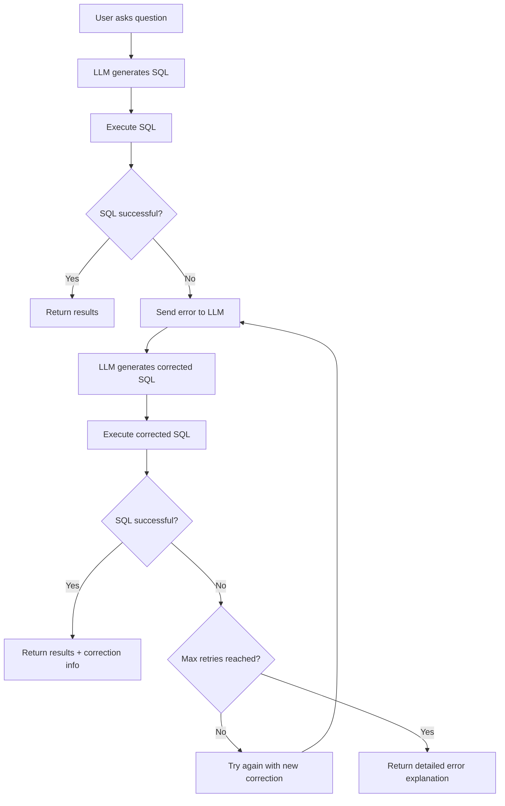

# SQL Auto-Retry Feature Guide

## Overview

The FastAPI VannaSQL implementation now includes an intelligent **SQL Auto-Retry** mechanism that automatically detects database errors and uses the LLM to generate corrected SQL queries.

## How It Works



## Configuration

### Default Settings
- **Max Retries**: 2 attempts (total of 3 SQL executions)
- **LLM Model**: Uses your configured model (phi4-mini:latest)
- **Error Types Handled**: All database errors (syntax, table/column names, permissions, etc.)

### Customization
You can modify the retry behavior in `fastapi_api.py`:

```python
# Change max retries (default is 2)
df, final_sql, error_history = await self._run_sql_with_retry(id, sql, max_retries=3)
```

## Response Format

### Successful Execution (No Errors)
```json
{
  "type": "df",
  "id": "query-uuid",
  "df": "[{...}]",
  "should_generate_chart": true,
  "sql_corrected": false,
  "correction_attempts": 0
}
```

### Successful Execution (After Auto-Correction)
```json
{
  "type": "df", 
  "id": "query-uuid",
  "df": "[{...}]",
  "should_generate_chart": true,
  "sql_corrected": true,
  "correction_attempts": 2
}
```

### Failed Execution (After Max Retries)
```json
{
  "type": "sql_error",
  "error": "SQL execution failed after 3 attempt(s). Final database error: Unknown column 'wrong_col' in 'field list'. One or more column names might be incorrect or don't exist in the specified table.",
  "error_history": [...],
  "max_retries_reached": true
}
```

## Error History Tracking

Each query attempt is tracked with detailed information:

```json
{
  "attempt": 1,
  "sql": "SELECT wrong_column FROM table",
  "database_error": "Unknown column 'wrong_column' in 'field list'",
  "corrected_sql": "SELECT correct_column FROM table",
  "timestamp": 1642608000.123
}
```

## API Endpoints

### Execute SQL with Auto-Retry
```http
GET /api/v0/run_sql?id={query_id}
```

### View Error History
```http
GET /api/v0/get_error_history?id={query_id}
```

## Error Types Handled

### 1. Table Name Errors
- **Error**: `Table 'db.wrong_table' doesn't exist`
- **LLM Action**: Suggests correct table name from schema
- **User Message**: "The table name might be incorrect or the table doesn't exist"

### 2. Column Name Errors  
- **Error**: `Unknown column 'wrong_col' in 'field list'`
- **LLM Action**: Suggests correct column names
- **User Message**: "One or more column names might be incorrect"

### 3. Syntax Errors
- **Error**: `SQL syntax error near 'SELEC'`
- **LLM Action**: Fixes SQL syntax
- **User Message**: "There's a SQL syntax error in the query"

### 4. Permission Errors
- **Error**: `Access denied for user`
- **LLM Action**: Suggests alternative queries or explains limitation
- **User Message**: "Database access permissions may be insufficient"

### 5. Timeout Errors
- **Error**: `Query execution timeout`
- **LLM Action**: Optimizes query or adds LIMIT clause
- **User Message**: "The query took too long to execute and timed out"

## Example Usage

### Python Client
```python
import requests

# Generate SQL
response = requests.get("http://localhost:8000/api/v0/generate_sql", 
                       params={"question": "Show me user data"})
query_id = response.json()["id"]

# Execute with auto-retry
response = requests.get("http://localhost:8000/api/v0/run_sql",
                       params={"id": query_id})

result = response.json()
if result["sql_corrected"]:
    print(f"SQL was auto-corrected after {result['correction_attempts']} attempts")
```

### Testing Auto-Retry
```bash
# Run the test script
python app/test_sql_auto_retry.py

# Test a specific problematic query
python app/test_sql_auto_retry.py "SELECT * FROM wrong_table_name"
```

## Benefits

### 1. **Improved User Experience**
- Users don't need to manually fix SQL errors
- Automatic correction of common mistakes
- Clear explanations when correction fails

### 2. **Reduced Manual Intervention**
- Handles typos in table/column names
- Fixes simple syntax errors
- Provides context-aware error messages

### 3. **Learning from Errors**
- LLM learns from database schema constraints
- Each correction attempt is logged for debugging
- Error patterns help improve future queries
- LLM provides context-aware explanations for failures

### 4. **Transparent Process**
- Users can see if their query was corrected
- Full error history available for debugging
- Number of correction attempts shown

## Advanced Features

### Custom Error Prompts
The LLM receives detailed context for error correction:

```text
The following SQL query failed with a database error:

Original Question: Show me all users with their orders
Failed SQL: SELECT * FROM users u JOIN orders o ON u.user_id = o.user_id
Database Error: Unknown column 'user_id' in 'on clause'

This is correction attempt #1. Please provide a corrected SQL query that fixes this specific error.
```

### LLM-Generated Error Explanations
When all retry attempts fail, the system uses the LLM to generate intelligent explanations:

```text
You are a SQL expert helping users understand why their query failed.

Original SQL Query: SELECT * FROM wrong_table
Error History:
Attempt 1:
  SQL: SELECT * FROM wrong_table
  Database Error: Table 'wrong_table' doesn't exist
  LLM Correction: SELECT * FROM discipline_data

The user tried to execute a SQL query but it failed after multiple correction attempts.
Please provide a clear, helpful explanation...
```

**LLM Response Example:**
```text
The main issue was that the table name 'wrong_table' doesn't exist in your database. 
The automatic correction attempted to use 'discipline_data' which is the correct table name.

However, the correction failed because [specific reason]. To fix this manually:
1. Check available tables using: SHOW TABLES;
2. Verify column names with: DESCRIBE discipline_data;
3. Use the correct table structure in your query.

The database schema shows that discipline-related data is stored in 'discipline_data' table.
```

### Error Pattern Recognition
The LLM analyzes error patterns and provides specific guidance:

- Table existence issues with suggested alternatives
- Column name mismatches with schema context
- Syntax problems with corrected examples
- Permission constraints with alternative approaches
- Performance issues with optimization suggestions

### Caching of Corrections
- Intermediate SQL attempts are cached
- Error history persists for analysis
- Successful corrections can inform future queries

## Monitoring and Debugging

### View Error Statistics
```bash
# Get error history for a specific query
curl "http://localhost:8000/api/v0/get_error_history?id=query-uuid"
```

### Log Analysis
The system logs all correction attempts:
```
Info: SQL correction attempt #1 for query: uuid
Info: Database error: Unknown column 'wrong_col'
Info: LLM generated correction: SELECT correct_col FROM table
```

This auto-retry feature significantly improves the robustness and user-friendliness of the VannaSQL system by automatically handling common database errors and providing intelligent corrections!
