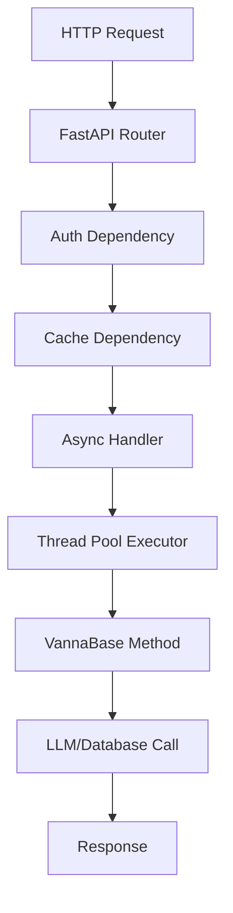

# VannaSQL FastAPI Integration

This directory contains the async FastAPI implementation of VannaSQL, providing the same functionality as the Flask version but with modern async/await support and automatic API documentation.

## Features

- **Async/Await Support**: All operations are fully asynchronous for better performance
- **Automatic API Documentation**: Built-in Swagger UI at `/docs` and ReDoc at `/redoc`
- **Type Safety**: Full Pydantic model validation for requests and responses
- **Better Performance**: Non-blocking I/O operations for database queries and LLM calls
- **Modern Python**: Uses FastAPI's dependency injection system

## Key Components

### 1. Cache System (`cache.py`)
- `AsyncCache`: Abstract base class for async cache implementations
- `AsyncMemoryCache`: Thread-safe in-memory cache with asyncio locks

### 2. Authentication (`auth.py`)
- `AsyncAuthInterface`: Abstract authentication interface
- `AsyncNoAuth`: Default no-authentication implementation

### 3. Main API (`fastapi_api.py`)
- `VannaFastAPI`: Core API implementation with all endpoints
- Async dependency injection for cache validation and user authentication
- Thread pool executor for CPU-bound operations (LLM calls, SQL execution)

### 4. UI Integration (`fastapi_app.py`)
- `VannaFastAPIApp`: Extends VannaFastAPI with UI routes
- Serves static assets and HTML interface
- Compatible with existing Vanna Flask UI assets

## Usage

### Basic Usage

```python
from app.vana_agent import vn
from app.vanna.fastapi import VannaFastAPIApp

# Create FastAPI app
app = VannaFastAPIApp(vn, allow_llm_to_see_data=True)

# Run the app
app.run(host='0.0.0.0', port=8000)
```

### Complete Web Interface

```bash
# Run the FastAPI web interface
python web_interface_fastapi.py
```

### API Endpoints

All endpoints from the Flask version are available with the same functionality:

- `GET /api/v0/generate_sql?question=...` - Generate SQL from question
- `GET /api/v0/run_sql?id=...` - Execute SQL query
- `GET /api/v0/generate_plotly_figure?id=...` - Create visualizations
- `POST /api/v0/train` - Add training data
- `GET /api/v0/get_training_data` - Retrieve training data
- And many more...

### Automatic Documentation

Visit these URLs when the app is running:
- `http://localhost:8000/docs` - Swagger UI with interactive API testing
- `http://localhost:8000/redoc` - ReDoc documentation
- `http://localhost:8000/` - Main VannaSQL interface

## Architecture Comparison

| Feature | Flask Version | FastAPI Version |
|---------|---------------|-----------------|
| **Concurrency** | Thread-based (WSGI) | Async/await (ASGI) |
| **Documentation** | Manual/Flasgger | Automatic/OpenAPI |
| **Type Safety** | Runtime validation | Compile-time + Pydantic |
| **Performance** | Blocking I/O | Non-blocking I/O |
| **WebSockets** | Flask-Sock | Native FastAPI |
| **Dependency Injection** | Custom decorators | Built-in DI system |

## Performance Benefits

1. **Non-blocking Operations**: Database queries and LLM calls don't block other requests
2. **Better Resource Usage**: More efficient handling of concurrent requests  
3. **Async Cache**: Thread-safe cache operations with async locks
4. **Connection Pooling**: Better database connection management

## Async Execution Flow



## Thread Pool Usage

CPU-bound operations are executed in a thread pool to avoid blocking the event loop:

```python
# Generate SQL asynchronously
sql = await asyncio.get_event_loop().run_in_executor(
    None, 
    self.vn.generate_sql, 
    question, 
    self.allow_llm_to_see_data
)
```

## Dependencies

The FastAPI implementation requires additional packages:

```bash
pip install fastapi uvicorn pydantic
```

For the complete web interface:
```bash
pip install fastapi[all] uvicorn[standard]
```

## Migration from Flask

To migrate from Flask to FastAPI:

1. Replace `from vanna.flask import VannaFlaskApp` with `from app.vanna.fastapi import VannaFastAPIApp`
2. Change `app.run()` parameters if needed (FastAPI uses uvicorn)
3. Update any custom authentication or cache implementations to async versions

The API endpoints remain the same, ensuring compatibility with existing frontend code.
